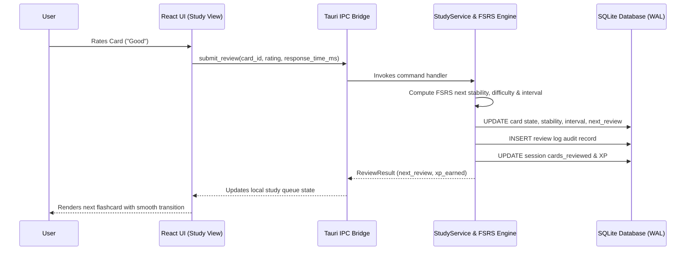

# Architecture of Lisan (لسان)

## 1. Architectural Philosophy
Lisan is built as a true local-first desktop application with a clear separation of concerns:
- **Rust Domain & Services**: The single source of truth for business logic, spaced repetition scheduling, database mutations, atomic backups, and media handling.
- **SQLite 3**: The persistent local database with WAL journal mode, strict foreign key constraints, and migrations.
- **React 19 + TypeScript**: Presentation and user interaction layer using Zustand for local UI state management, Tailwind CSS for responsive styling, and i18n for Arabic (RTL) and English support.
- **Tauri 2.x IPC**: Secure, typed command bridge communicating via JSON serializable DTOs.

---

## 2. Directory Structure

```
lisan/
├── src-tauri/               # Rust Backend
│   ├── src/
│   │   ├── commands/        # Tauri IPC command handlers
│   │   ├── domain/          # Domain entities & DTOs
│   │   ├── scheduler/       # FSRS memory model & prioritizer
│   │   ├── database/        # rusqlite connection, migrations, repositories
│   │   ├── services/        # Application services layer
│   │   └── errors/          # Structured AppError types
│   ├── tauri.conf.json      # Tauri application configuration
│   └── Cargo.toml           # Rust dependencies
├── src/                     # React Frontend
│   ├── components/          # Reusable UI & view components
│   ├── pages/               # Top-level screen views
│   ├── stores/              # Zustand global stores
│   ├── services/            # Typed IPC client & wrappers
│   ├── types/               # TypeScript interfaces
│   └── i18n/                # Translation catalogs (EN/AR)
└── package.json             # Frontend dependencies
```

---

## 3. Data Flow



---

## 4. Error Handling Strategy
Errors in Rust are modeled using `thiserror` in `AppError` and serialized into structured JSON with error codes:
- `DATABASE_ERROR`
- `NOT_FOUND`
- `VALIDATION_ERROR`
- `SCHEDULER_ERROR`
- `MEDIA_ERROR`
- `IMPORT_EXPORT_ERROR`
- `INTERNAL_ERROR`

Errors bubble up to the frontend and are displayed gracefully via toast notifications or contextual error boundaries.
