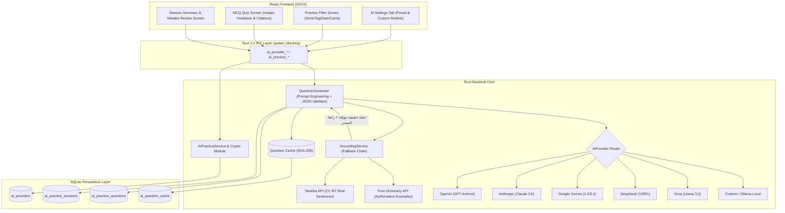
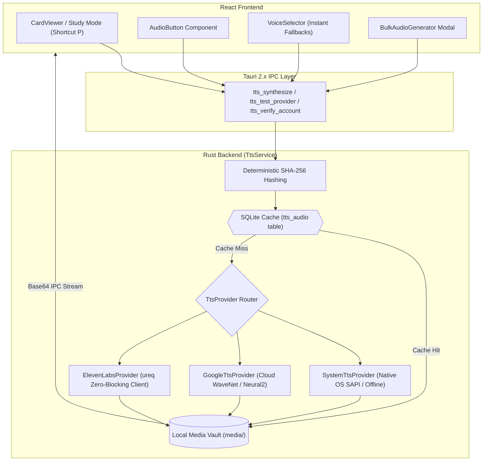

<div align="center">

# 🧠 لِسان (Lisan) — نظام التعلّم الذكي والتكرار المتباعد
### The Intelligent Spaced-Repetition Desktop Learning OS

<p align="center">
  <strong>تطبيق مكتبي متكامل (Cross-Platform Native Desktop Application) يجمع بين أحدث خوارزميات التكرار المتباعد (FSRS Memory Engine)، والاسترجاع النشط (Active Recall)، ونظام النطق الصوتي الفوري فائق الواقعية (Neural & Local Text-to-Speech)، وإدارة جلسات التركيز (Pomodoro)، والتحليلات العميقة للذاكرة.</strong>
</p>

<p align="center">
  
  
  
  
  
  
  
  
  
</p>

</div>

---

## 📑 جدول المحتويات (Table of Contents)

1. [نظرة عامة على المشروع (Project Description)](#-نظرة-عامة-على-المشروع-project-description)
2. [المشكلة التي يحلها التطبيق (Problem It Solves)](#-المشكلة-التي-يحلها-التطبيق-problem-it-solves)
3. [الميزات والقدرات الرئيسية (Key Features)](#-الميزات-والقدرات-الرئيسية-key-features)
4. [التدريب بالذكاء الاصطناعي والتأصيل الواقعي (AI Practice & Grounding Architecture)](#-التدريب-بالذكاء-الاصطناعي-والتأصيل-الواقعي-ai-practice--grounding-architecture)
5. [منظومة النطق الصوتي وتحويل النص لكلام (TTS Architecture)](#-منظومة-النطق-الصوتي-وتحويل-النص-لكلام-tts-architecture)
6. [التقنيات المستخدمة وسبب اختيارها (Tech Stack & Rationale)](#-التقنيات-المستخدمة-وسبب-اختيارها-tech-stack--rationale)
7. [الهندسة المعمارية والقرارات التقنية (The Process & Architecture)](#-الهندسة-المعمارية-والقرارات-التقنية-the-process--architecture)
8. [دليل البدء والتشغيل (Getting Started)](#-دليل-البدء-والتشغيل-getting-started)
9. [الطبقة السردية: الدافع، التحديات والحلول (Storytelling Layer)](#-الطبقة-السردية-الدافع-التحديات-والحلول-storytelling-layer)
10. [النتائج والأثر الملموس (Outcomes & Impact)](#-النتائج-والأثر-الملموس-outcomes--impact)
11. [القيود وخريطة الطريق المستقبلية (Limitations & Future Work)](#-القيود-وخريطة-الطريق-المستقبلية-limitations--future-work)
12. [الجمهور المستهدف والاستخدام المقصود (Intended Use)](#-الجمهور-المستهدف-والاستخدام-المقصود-intended-use)
13. [الحقوق والترخيص (Credits & License)](#-الحقوق-والترخيص-credits--license)

---

## 🌟 نظرة عامة على المشروع (Project Description)

**«لِسان» (Lisan)** ليس مجرد تطبيق تقليدي لعرض البطاقات التعليمية (Flashcards)، بل هو **نظام تشغيل معرفي متكامل (Personal Learning OS)** مصمم محلياً بالكامل (Offline-First & Local-First). 

يقوم النظام بنمذجة ذاكرة المتعلّم رياضياً بالاعتماد على خوارزمية **FSRS (Free Spaced Repetition Scheduler)** الحديثة، للتنبؤ بدقة بلحظة تلاشي المعلومة وجدولة المراجعات بالوقت الأمثل قبل النسيان مباشرة. كما يحتوي على **محرك نطق صوتي متقدم (Text-to-Speech Engine)** يدعم النطق الصوتي الفوري للكلمات والجمل عبر محركات محلية مجانية ومحركات سحابية فائقة الواقعية (مثل **ElevenLabs AI** و **Google Cloud TTS**) مع تخزين مؤقت حتمي (Deterministic SHA-256 Audio Cache)، مع دمج تقنية **بومودورو (Pomodoro Focus)** لقياس سرعة الاستجابة والتركيز الذهني وتحويل التعلّم إلى عادة يومية مستدامة.

---

## 🛑 المشكلة التي يحلها التطبيق (Problem It Solves)

| التحدي التقليدي | كيف يعالجه تطبيق «لِسان»؟ |
| :--- | :--- |
| **منحنى النسيان السريع (Forgetting Curve)** | ينسى الإنسان أكثر من 70% من المعلومات الجديدة خلال 48 ساعة دون مراجعة منتظمة ومجدولة علمياً. | يعتمد التطبيق نموذج الذاكرة ثلاثي الأبعاد: **الثبات ($S$)**، **الصعوبة ($D$)**، و**قابلية الاسترجاع ($R$)** لإعادة الحساب ديناميكياً لكل بطاقة عبر FSRS. |
| **صعوبة النطق وتعلّم اللغات بدون صوت أصلي** | تفتقر معظم تطبيقات الفلاش كارد إلى نطق صوتي مدمج وتعتمد على إرفاق ملفات mp3 يدوياً لكل كلمة. | **توليد نطق صوتي فوري وتلقائي (TTS)**؛ بنقرة زر أو باختصار `P`، مع دعم ElevenLabs (أصوات الذكاء الاصطناعي التوليدي) والمحركات المحلية المجانية دون استهلاك متكرر. |
| **تشتت الانتباه وغياب التركيز أثناء المذاكرة** | يعاني الطلاب والمتعلمون من المماطلة وتشتت الانتباه المستمر أثناء المراجعة. | يدمج مؤقت بومودورو مع وضع التركيز الكامل (Distraction-Free Focus Mode) لتتبع المراجعات في سياق زمني محكم. |
| **الاعتماد الإجباري على السحابة وتهديد الخصوصية** | تتطلب معظم التطبيقات الحديثة اتصالات إنترنت دائمة وتخزن بيانات المستخدم الشخصية على خوادم خارجية. | **معمارية محلية أولاً (Local-First)**؛ قاعدة بيانات SQLite فائقة السرعة، بدون أي متطلبات اتصال إجباري أو جمع بيانات خارجية. |
| **ضعف دعم اللغة العربية وتجارب الاستخدام المعربة** | تفتقر معظم أدوات التعلّم المتقدمة (مثل Anki) إلى واجهات عربية أصيلة تدعم اليمين لليسار (RTL) بشكل انسيابي وتجربة مستخدم عصرية. | واجهة عربية وإنجليزية مكتوبة أصلياً بأحدث معايير الـ UI/UX مع دعم كامل لاتجاه RTL والخطوط العربية الحديثة. |

---

## ⚡ الميزات والقدرات الرئيسية (Key Features)

### 1. محرك التكرار المتباعد الحديث (FSRS Spaced-Repetition Engine)
- لا يعتمد على جداول ثابتة عشوائية (مثل 1 يوم / 3 أيام / 7 أيام).
- حساب فترات المراجعة التقديرية مباشرة على أزرار التقييم الأربعة: **أعدها (`< 10m`)**، **صعبة (`1d`)**، **جيدة (`3d`)**، و**سهلة (`8d+`)**.
- الانتقال الحتمي بين حالات البطاقة: `جديدة (New)`، `قيد التعلّم (Learning)`، `مراجعة (Review)`، `إعادة تعلّم (Relearning)`، و`معلّقة (Suspended)`.

### 2. التدريب الذكي بالذكاء الاصطناعي والتأصيل الواقعي (AI Practice & Grounding)
- **اختبارات اختيار من متعدد (MCQ) فائقة الواقعية** مبنية على بطاقات ومفردات المستخدم الحقيقية.
- **تأصيل واقعي حقيقي (Grounded Citations)**: يجلب النظام جملاً بشرية حقيقية مترجمة من قاعدة بيانات **Tatoeba** وقاموس **Free Dictionary API** قبل استدعاء النموذج اللغوي لضمان عدم اختلاق أمثلة وهمية.
- **دعم أشهر نماذج ومزودي الذكاء الاصطناعي**: OpenAI (GPT-4o/mini, o3-mini)، Anthropic (Claude 3.5 Sonnet/Haiku)، Google Gemini (1.5/2.0 Flash)، DeepSeek (V3/R1)، و Groq (Llama 3.3).
- **دعم المزودات المخصصة والمحلية (Custom / Local LLMs)**: ربط أي خادم متوافق مع OpenAI مثل **Ollama** محلياً أو **LM Studio** أو **OpenRouter**.
- **فلترة متقدمة للبطاقات**: إمكانية التدريب على بطاقات محددة بالبحث، أو رزمة معينة، أو وسم محدد، أو **حسب تاريخ إضافة البطاقات (Date Added Range)**.
- **أمان ومكافحة الغش**: حجب الإجابة الصحيحة `correct_option` في السيرفر وعدم إرسالها للواجهة إلا بعد الاختيار.
- **كاش ذكي للأسئلة (SHA-256 Question Cache)** لتوفير استهلاك الـ API وتكاليف التوليد.

### 3. منظومة النطق الصوتي الفوري (Text-to-Speech & Pronunciation)
- استمع لنطق أي بطاقة، مصطلح، أو جملة فورياً.
- دعم كامل لأحدث نماذج **ElevenLabs Generative AI** مع الأصوات الطبيعية المجانية المعتمدة (**Adam**, **Sarah**, **George**, **Daniel**, **Antoni**).
- لوحة تشخيص وفحص الرصيد والحساب الحي (Live Account Quota & Permissions Diagnostic).
- اختصار لوحة المفاتيح العالمي **`P`** (أو **`ح`** على لوحة المفاتيح العربية) لتشغيل النطق فوراً في وضع المراجعة.
- خيار **التشغيل التلقائي (Auto-Play)** لنطق الكلمة بمجرد ظهور وجه البطاقة.
- أداة **توليد أصوات الرزمة دفعة واحدة (Bulk Deck Audio Generator)** مع شريط تقدم مباشر وحساب تقديري للحجم.
- تحكم دقيق في سرعة النطق (`0.5x`, `0.75x`, `0.9x`, `1.0x`, `1.25x`, `1.5x`) وطبقة الصوت.

### 4. الأولوية الذكية لقائمة المراجعة (Intelligent Prioritization)
- ترتيب البطاقات ليس مجرد ترتيب زمني؛ بل يعتمد على معادلة ترجيحية تجمع بين: **نسبة التأخير عن الموعد**، **خطر النسيان ($1 - R$)**، **صعوبة البطاقة**، **معدل الإخفاق التاريخي**، و**أولوية الرزمة**.

### 5. منظومة بومودورو المندمجة مع الاستذكار
- تخصيص كامل لفترات التركيز (25 دقيقة)، والاستراحات القصيرة (5 دقائق)، والطويلة (15 دقيقة).
- تسجيل إحصائيات الجلسة: (البطاقات المراجعة، دقة الاسترجاع، زمن الإجابة، ونقاط الخبرة المكتسبة XP).

### 6. خريطة النشاط والتحليلات العميقة (Knowledge Heatmap & Analytics)
- خريطة نشاط سنوية (365 يوماً) على غرار GitHub Heatmap للتبديل بين عدد البطاقات ودقائق الدراسة.
- رسوم بيانية تفاعلية لحجم المراجعات ومنحنى استقرار الذاكرة (Retention Trend).
- قائمة كشف نقاط الضعف (Weak Cards Diagnostic) لتحديد البطاقات المتكررة الرسوب.

### 7. محرر بطاقات غني ومعاينة النطق وملء الفراغات (Cloze Deletion)
- دعم البطاقات الأساسية (وجه / ظهر)، وبطاقات ملء الفراغات التلقائية بترميز `{{c1::النص}}`.
- معاينة فورية للنطق الصوتي داخل نافذة إنشاء وتعديل البطاقة.
- تنسيق النص الغني (Bold, Italic, Inline Code)، وإرفاق الوسوم والوسائط المتعددة.

---

## 🤖 التدريب بالذكاء الاصطناعي والتأصيل الواقعي (AI Practice & Grounding Architecture)

تم تصميم معمارية التدريب بالذكاء الاصطناعي لتفصل بين جلب السياق الواقعي الحقيقي وتوليد الأسئلة بواسطة النماذج اللغوية:



### مزايا معمارية الذكاء الاصطناعي:
1. **تأصيل واقعي حقيقي (Grounded Citations)**: بدلاً من الاعتماد على اختلاق النماذج لأمثلة غير دقيقة، يقوم `GroundingService` بالبحث في قاعدة بيانات **Tatoeba** المفتوحة وقاموس **Free Dictionary** لجلب جملة بشرية معتمدة قبل استدعاء النموذج، وتضمين رابط المصدر مباشرة في السؤال.
2. **أمان تام للمفاتيح (Encrypted Key Storage)**: تشفير كافة المفاتيح عبر خوارزمية تجزئة قائمة على Salt الجهاز في وحدة `crypto.rs` قبل الحفظ في SQLite.
3. **تعدد المزودات المفتوح (Multi-Provider & Local LLMs)**: التبديل الفوري بين OpenAI و Anthropic و Google Gemini و DeepSeek و Groq، أو تشغيل خوادم محلية خاصة عبر **Ollama** مجاناً دون إرسال أي بيانات لخوادم خارجية.
4. **منع الغش البرمجي (Zero Client-Side Leak)**: يتم التحقق من الإجابة حصرياً في Rust، ولا يتم إرسال `correct_option` للـ Frontend إلا بعد قيام المستخدم بالاختيار.

---

## 🔊 منظومة النطق الصوتي وتحويل النص لكلام (TTS Architecture)

صُممت المنظومة الصوتية وفق نمط تجريد المزودين (Provider Abstraction Pattern) لتتيح تشغيلاً محلياً غير متصل مجاناً بالكامل، أو عبر واجهات الذكاء الاصطناعي السحابية:



### مزودو الخدمة المدعومون (Supported Providers):
1. **ElevenLabs AI (الجيل الأحدث من الصوت العصبي)**:
   - دعم مباشر للغة العربية وأكثر من 29 لغة عالمية عبر نموذج `eleven_multilingual_v2`.
   - التوافق الكامل مع الأصوات الافتراضية المجانية (**Adam, Sarah, George, Daniel, Antoni**).
   - تشغيل متزامن غير حاجز (Zero-Blocking Sync IO) عبر مكتبة `ureq` الخفيفة لتفادي تعارض خيوط Tokio الرستمية.
   - فحص ذكي ثلاثي المراحل لمفاتيح الـ API (التحقق من الرصيد والاشتراك ➔ الموديلات ➔ اختبار النبضة الصوتية المباشر).
2. **نظام التشغيل المحلي (System TTS)**:
   - يعمل محلياً 100% دون الحاجة إلى إنترنت أو مفاتيح API.
   - على Windows: يستخدم واجهة `System.Speech.Synthesis` و SAPI لتوليد ملفات `.wav` فائقة النقاء فورياً.
   - على macOS: يستخدم محرك `say` الأصلي.
   - على Linux: يستخدم `espeak-ng` / `speech-dispatcher`.
3. **Google Cloud Text-to-Speech**:
   - دعم كامل للأصوات القياسية وأصوات WaveNet و Neural2 عالية الدقة بأكثر من 40 لغة.

### التخزين المؤقت الحتمي (Deterministic SHA-256 Caching):
- يتم استخراج بصمة تجزئة فريدة لكل طلب: `hash = SHA256(text + language + provider + voice + speed + pitch)`.
- يتم حفظ الملف في مستودع الوسائط المشفر (`media/`) وتسجيله في جدول `tts_audio`.
- تضمن هذه الآلية ألا يُطلب نطق نفس المصطلح مرتين أبداً، مما يوفر استهلاك الـ API والوقت ويجعل النطق لحظياً (`< 5ms`).
- إمكانية تنظيف الملفات الصوتية غير المستخدمة بنقرة زر من تبويب الإعدادات.

---

## 🛠️ التقنيات المستخدمة وسبب اختيارها (Tech Stack & Rationale)

```mermaid
graph LR
    UI[React 19 + TypeScript + Tailwind] -- "Tauri IPC (Commands)" --> Rust[Rust Backend Core]
    Rust --> FSRS[FSRS Scheduler Engine]
    Rust --> TTS[TTS & Audio Engine (ureq + SAPI)]
    Rust --> Pomo[Monotonic Timer & XP Service]
    Rust --> SQLite[(SQLite 3 + WAL + FTS5)]
```

| الطبقة التقنية | التقنية المختارة | سبب الاختيار الهندسي (Rationale) |
| :--- | :--- | :--- |
| **إطار التطبيق المكتبي** | **Tauri 2.x** | يوفر تطبيقاً مكتبياً أصيلاً بحجم لا يتجاوز 15 ميغابايت، واستهلاك ذاكرة ضئيل جداً مقارنة بـ Electron، مع أمان فائق عبر عزل الصلاحيات ونظام IPC منيع. |
| **لغة المعالجة الخلفية** | **Rust 2021** | ضمان أمان الذاكرة والسرعة القصوى، وعدم وجود Garbage Collector، مما يجعل عمليات الحسابات الإحصائية وجدولة مئات آلاف البطاقات وتوليد الصوت فورية دون تجميد الواجهة. |
| **محرك الشبكة والصوت** | **ureq (TLS) + SAPI** | شبكة غير متداخلة مع Tokio Runtimes لمنع أي انهيارات برمجية (Zero-Tokio Drop Panics)، مع معالجة غير حاجزة ونظام كاش ذري. |
| **قاعدة البيانات** | **SQLite 3 (rusqlite)** | أفضل محرك تخزين محلي غير متصل، تم تفعيله بوضع **WAL (Write-Ahead Logging)** مع قفل متكيف للتعافي من التسمم (Poison-Resilient Mutex)، وفهرسة كاملة ودعم البحث النصي **FTS5**. |
| **واجهة المستخدم** | **React + TypeScript** | بناء واجهة مستخدم مرنة وقابلة للصيانة بنظام المكونات المعيارية، مع فحص صارم للأنواع لمنع الأخطاء البرمجية أثناء وقت التطوير. |
| **إدارة الحالة** | **Zustand** | مكتبة إدارة حالة فائقة الخفة وبسيطة المعمارية، تلغي الحاجة للتعقيدات الزائدة وتوفر وصولاً سريعاً دون إعادة تصيير (Re-renders) غير ضرورية. |
| **التصميم والأنماط** | **Tailwind CSS** | نظام تصميم معتمد على Tokens قابلة للتخصيص، مع دعم أصيل وديناميكي لتبديل السمات (داكن / فاتح) واتجاه القراءة العربي (RTL Layout). |

---

## ⚙️ الهندسة المعمارية والقرارات التقنية (The Process & Architecture)

تم بناء المشروع وفق معمارية الطبقات النظيفة (Clean Layered Architecture):

```
┌─────────────────────────────────────────────────────────────┐
│ 1. Frontend Layer (React 19 + Zustand + Tailwind + i18n)    │
│    - Views: Dashboard | Study | Practice | Decks | Browser  │
│    - Audio: AudioButton, AudioPlayer, VoiceSelector, BulkGen│
│    - AI: AiSettings, Practice Quiz View, Summary View       │
└──────────────────────────────┬──────────────────────────────┘
                                │ Typed Tauri IPC Invocations
┌──────────────────────────────▼──────────────────────────────┐
│ 2. Tauri IPC Boundary & Command Handlers (Rust)             │
│    - Commands: cards, decks, reviews, tts, ai_practice...   │
└──────────────────────────────┬──────────────────────────────┘
                                │
┌──────────────────────────────▼──────────────────────────────┐
│ 3. Application Services & Domain Core                       │
│    - StudyService (FSRS Math & Prioritizer)                 │
│    - AiPracticeService & GroundingService (Tatoeba / Dict)  │
│    - TtsService (System SAPI, Google Cloud, ElevenLabs)     │
│    - MediaService (Media Vault & Base64 Streamer)           │
│    - PomodoroService & AnalyticsService                     │
│    - BackupService (Atomic SQLite VACUUM INTO)              │
└──────────────────────────────┬──────────────────────────────┘
                                │
┌──────────────────────────────▼──────────────────────────────┐
│ 4. Persistence Layer (rusqlite Repositories + Migrations)   │
│    - SQLite 3 (WAL mode, Foreign Keys, Schema Migrations)   │
│    - Poison-Resilient Mutex Locking Strategy                │
│    - Migrations: 001_initial, 002_seed, 003_tts, 004_ai     │
└─────────────────────────────────────────────────────────────┘
```

### قرارات هندسية بارزة:
1. **حظر وضع منطق العمليات (Business Logic) في React**: الواجهة مسؤولة فقط عن العرض والتفاعل، بينما تُنفذ كافة الحسابات الرياضية والتحقق وتوليد الصوت وتأصيل الأسئلة حصرياً داخل Rust.
2. **استخدام نظام الهجرات التلقائية المتسلسل (SQL Migrations)**: لا يتم تعديل أي جداول يدوياً؛ بل تُطبق ملفات `001_initial.sql` و`002_seed.sql` و`003_tts_audio.sql` و`004_ai_practice.sql` داخل معاملات ذرية آمنة عند إقلاع التطبيق.
3. **أمان مفاتيح الـ API (API Keys Security)**: تشفير مفاتيح كافة المزودين عبر Keystream Salted Hashing في Rust قبل حفظها في SQLite.
4. **تأصيل مصادر الأسئلة (Source Grounding)**: ربط كل سؤال تم توليده بجملة بشرية مترجمة معتمدة (Tatoeba CC BY) لتجنب أخطاء التوليد اللغوي.
5. **مؤقت ذو مرجعية زمنية حقيقية (Monotonic Timestamps)**: مؤقت بومودورو يعتمد على فوارق الطوابع الزمنية وليس على دقة `setInterval` في جافاسكريبت، لضمان عدم تأخر المؤقت عند تصغير النافذة.

---

## 🚀 دليل البدء والتشغيل (Getting Started)

### المتطلبات الأساسية (Prerequisites)
- تثبيت [Node.js](https://nodejs.org/) (الإصدار 18 أو أحدث).
- تثبيت مترجم [Rust](https://rustup.rs/) (الإصدار 1.75 أو أحدث).
- نظام تشغيل: Windows 10/11 أو macOS أو Linux.

### 1. استنساخ المشروع (Clone Repository)
```bash
git clone https://github.com/Omar-b381/Lisan-Intelligent-Personal-Learning-OS.git
cd Lisan-Intelligent-Personal-Learning-OS
```

### 2. تثبيت الحزم (Install Dependencies)
```bash
npm install
```

### 3. تشغيل بيئة التطوير (Run Development)
```bash
# تشغيل خادم التطوير وتطبيق سطح المكتب معاً
npm run tauri dev
```

### 4. تشغيل الاختبارات الآلية (Run Tests)
```bash
# فحص وتأكيد منطق خوارزمية التكرار FSRS ونظام الـ TTS وقاعدة البيانات
cargo test --manifest-path src-tauri/Cargo.toml
```

### 5. بناء الحزمة الإنتاجية النهائية (Production Build)
```bash
# توليد ملف التثبيت المكتبي المستقل (.exe / .dmg / .deb)
npm run tauri build
```

---

## 📖 الطبقة السردية: الدافع، التحديات والحلول (Storytelling Layer)

### 💡 الدافع وراء المشروع (Motivation)
يواجه المتعلمون المعاصرون طوفاناً هائلاً من المعلومات في مجالات مثل تعلم اللغات، البرمجة، والعلوم الطبية. غالبية الأدوات المتاحة إما معقدة للغاية وتعتمد على خوارزميات قديمة ترجع للثمانينات (مثل SM-2 في Anki القديم)، أو تعتمد بالكامل على السحابة وتفتقر للسرعة والخصوصية ودعم اللغة العربية الأصيل والنطق الصوتي الفوري. بنينا «لِسان» ليكون بيئة تعلم شخصية متكاملة وسريعة كسرعة البرق، تدمج العلم المعرفي الحديث بالإنتاجية والصوت.

### 🧗 التحديات التقنية الكبرى وكيف تم التغلب عليها:

#### التحدي 1: نمذجة خوارزمية FSRS بدقة رياضية حتمية
- **المشكلة**: تتطلب خوارزمية FSRS حساب معادلات أُسية متداخلة للتنبؤ بثبات الذاكرة ($S$) وصعوبة السؤال ($D$) لكل تقييم، ويجب تقديم المعاينات التقديرية للأزرار في جزء من المللي ثانية دون أي تأخير في الواجهة.
- **الحل**: قمنا ببناء محرك رياضي مستقل في Rust داخل وحدة `src-tauri/src/scheduler/fsrs.rs` مدعوم باختبارات وحدة آلية للتحقق من دقة التنبؤ بالاسترجاع ومنع أي أخطاء حسابية أو حالات فيضان رقمي.

#### التحدي 2: تكامل النطق الصوتي التوليدي (ElevenLabs) بدون صراعات Tokio Runtimes
- **المشكلة**: استخدام عملاء HTTP متزامنين مدمجين مع Tokio داخل بيئة Tauri كان يطلق انهيارات غير متزامنة (`Cannot drop a runtime in a context where blocking is not allowed`) مع تسمم أقفال قاعدة البيانات.
- **الحل**: تم الانتقال لمحرك `ureq` النقي غير المتداخل مع Runtimes، وتزويد قفل قاعدة البيانات بآلية استعادة تلقائية عند التسمم (`poisoned.into_inner()`)، مع توفير قائمة أصوات مجانية افتراضية وتوليد فوري.

#### التحدي 3: تجربة ثنائية اللغة تدعم RTL الأصيل بدون انكسار الواجهة
- **المشكلة**: غالباً ما تتسبب الواجهات المعربة في تشوه محاذاة الأيقونات واختصارات لوحة المفاتيح والرسوم البيانية.
- **الحل**: استخدمنا نظام قوالب Tailwind المرن مع خصائص CSS المنطقية (Logical Properties) ومحددات الاتجاه، مع عزل نصوص الواجهة في قواميس `en.ts` و`ar.ts`، لضمان انتقال سلس وانعكاس دقيق بنقرة زر واحدة.

---

## 📊 النتائج والأثر الملموس (Outcomes & Impact)

- **سرعة تشغيل وإقلاع فائقة**: يبدأ التطبيق في أقل من ثانية واحدة بفضل معمارية Tauri وRust الخفيفة.
- **استجابة صوتية فورية (`< 5ms`)**: تشغيل النطق الصوتي للبطاقات بضغطة زر أو باختصار `P` دون أي تأخير بفضل الكاش الذكي.
- **كفاءة الذاكرة**: استهلاك رام لا يتجاوز 60-80 ميغابايت أثناء التشغيل مقارنة بـ 400+ ميغابايت في تطبيقات الويب المغلفة (Electron).
- **تجربة خالية من التشتيت**: تمكين المتعلّم من إنجاز مئات المراجعات اليومية بالكامل عبر اختصارات لوحة المفاتيح (`Space` للإظهار، `P` للنطق، و`1`, `2`, `3`, `4` للتقييم، و`Ctrl+K` للبحث السريع).
- **أمان وموثوقية البيانات**: حفظ فوري في SQLite مع إمكانية أخذ نسخ احتياطية بضغطة زر واحدة دون قفل قاعدة البيانات.

---

## 🔮 القيود وخريطة الطريق المستقبلية (Limitations & Future Work)

- [ ] **المزامنة السحابية المشفرة (E2E Encrypted Sync)**: دعم المزامنة الاختيارية المباشرة بين الأجهزة بدون خادم وسيط مع تشفير طرف لطرف.
- [ ] **توليد البطاقات بالذكاء الاصطناعي (AI Flashcard Generation)**: دعم موفري الذكاء الاصطناعي (Local LLMs عبر Ollama أو OpenAI/Anthropic) لتوليد بطاقات ملء الفراغات من المستندات والمقالات الطويلة.
- [ ] **تطبيق الهاتف المحمول (Mobile Companion)**: تمديد قاعدة كود Tauri 2.x لدعم منصتي iOS وAndroid بمزامنة محلية.
- [ ] **دعم استيراد حزم Anki (.apkg)**: قراءة وفك حزم أنكي المتقدمة مع وسائطها تلقائياً.

---

## 🎯 الجمهور المستهدف والاستخدام المقصود (Intended Use)

1. **متعلمو اللغات**: لبناء المفردات والتراكيب والاستماع للنطق السليم واستذكار القواعد من خلال سياقات ملء الفراغات (Cloze Deletions).
2. **مبرمجو ومطورو النظم**: لحفظ المفاهيم الهندسية، واجهات برمجة التطبيقات (APIs)، وتراكيب اللغات البرمجية وأنماط التصميم.
3. **طلاب الطب والعلوم**: لاستيعاب المصطلحات التشريحية والدوائية الكثيفة بدقة واستدامة.
4. **المحترفون والباحثون**: لإدارة المعرفة الشخصية وبناء بنك ذاكرة طويل الأمد دائم الحضور.

---

## 📜 الحقوق والترخيص (Credits & License)

- **المطور**: فريق تطوير نظام «لِسان» (Lisan OS Team).
- **الأسس العلمية**: مستوحى من أبحاث منحنى النسيان لـ Ebbinghaus وأحدث أبحاث خوارزمية **FSRS (Free Spaced Repetition Scheduler)**.
- **الترخيص**: هذا المشروع مرخص تحت رخصة **[MIT License](file:///d:/PROJECTSIMPORTANT/Lisan/LICENSE)** — يمكنك استخدامه، تعديله، وتوزيعه بحرية كاملة.

<div align="center">
  <br />
  <sub>صُنع بشغف لتمكين كل متعلّم من ترويض الذاكرة وبناء عادة تعلّم يومية مستدامة.</sub>
</div>
